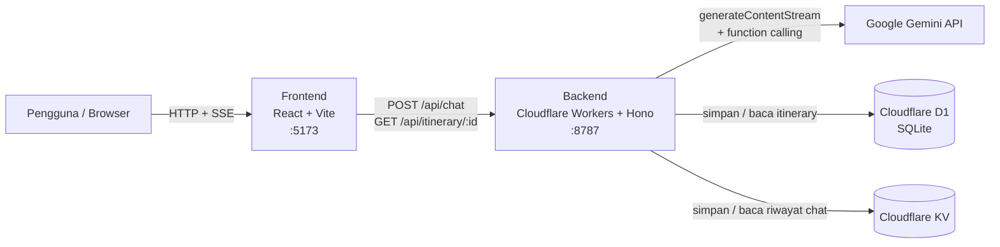
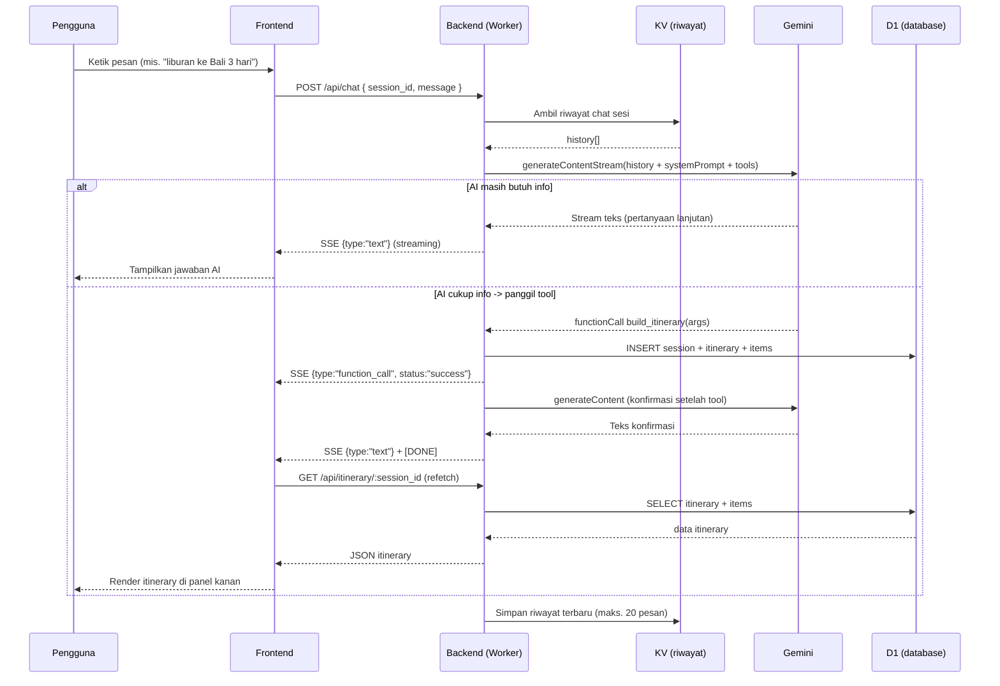
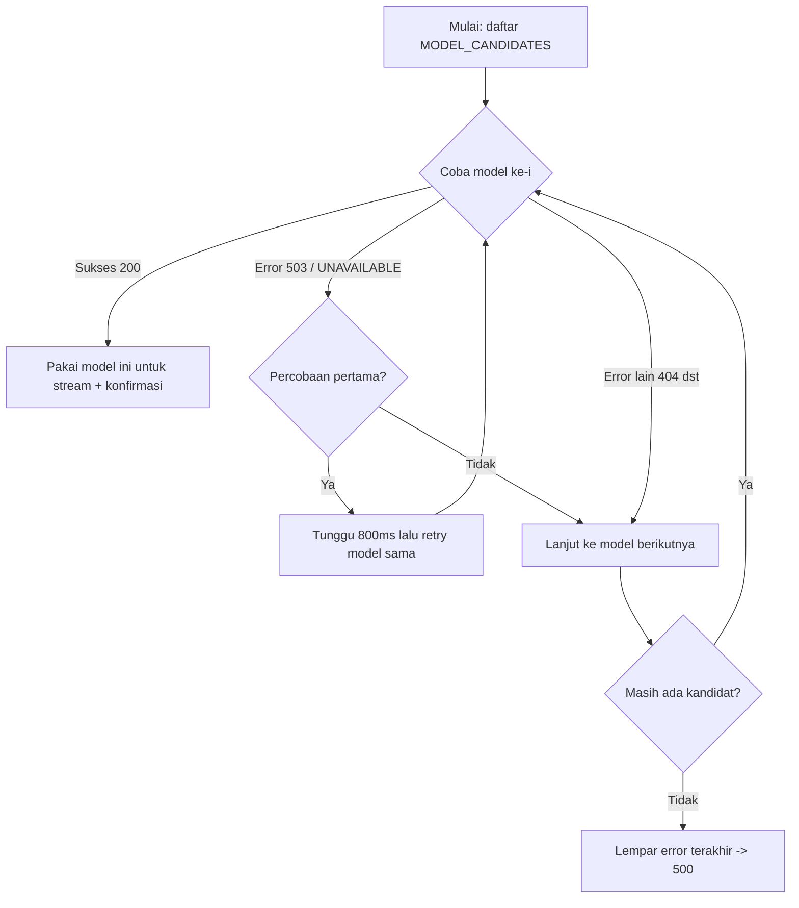

# AI Travel Planner Chatbot

Chatbot perencana perjalanan berbasis AI. Pengguna mengobrol dengan asisten (Bahasa Indonesia), lalu AI otomatis menyusun **itinerary multi-hari** yang terstruktur dan menyimpannya ke database cloud. Itinerary bisa diekspor ke **kalender (.ics)** atau dicetak sebagai **PDF**.

Dibangun dengan React + Vite di sisi frontend dan Cloudflare Workers (Hono) + D1 + KV + Google Gemini di sisi backend.

---

## Daftar Isi
- [Fitur](#fitur)
- [Arsitektur](#arsitektur)
- [Alur Aplikasi (Flow)](#alur-aplikasi-flow)
- [Struktur Proyek](#struktur-proyek)
- [Teknologi](#teknologi)
- [Prasyarat](#prasyarat)
- [Setup & Menjalankan Lokal](#setup--menjalankan-lokal)
- [Variabel Lingkungan](#variabel-lingkungan)
- [Skema Database](#skema-database)
- [Referensi API](#referensi-api)
- [Deploy](#deploy)
- [Troubleshooting](#troubleshooting)

---

## Fitur
- 💬 Chat percakapan dengan AI travel planner (streaming jawaban via SSE).
- 🧠 **Function calling** Gemini: AI memutuskan sendiri kapan cukup informasi untuk menyusun itinerary.
- 🗓️ Itinerary multi-hari terstruktur (hari, waktu, judul, deskripsi, kategori).
- ☁️ Penyimpanan cloud: itinerary di **Cloudflare D1** (SQLite), riwayat chat di **Cloudflare KV**.
- 📅 Ekspor ke kalender (`.ics`) dan cetak PDF.
- 🔄 Retry + fallback model otomatis saat model Gemini sedang overload (503).

---

## Arsitektur



Komponen utama:
- **Frontend** — antarmuka chat + panel itinerary. Membaca stream SSE dari backend dan me-render pesan serta itinerary secara real-time.
- **Backend** — API Hono di atas Cloudflare Workers. Mengorkestrasi Gemini, D1, dan KV.
- **Gemini** — model bahasa yang menghasilkan balasan dan memicu tool `build_itinerary`.
- **D1** — database relasional untuk `sessions`, `itineraries`, `itinerary_items`.
- **KV** — key-value store untuk riwayat percakapan per sesi.

---

## Alur Aplikasi (Flow)

### 1. Alur percakapan & pembuatan itinerary



### 2. Logika pemilihan model (retry + fallback)

Saat memanggil Gemini, backend mencoba daftar model secara berurutan. Jika sebuah model mengembalikan **503 (overload)**, ia retry sekali, lalu jatuh ke model berikutnya.



---

## Struktur Proyek

```
.
├── .gitignore
├── README.md
├── backend/                 # Cloudflare Workers (Hono)
│   ├── src/
│   │   ├── index.ts         # Entry point + routing + CORS
│   │   ├── chat.ts          # Handler /api/chat (Gemini, streaming, D1, KV)
│   │   ├── itinerary.ts     # Handler /api/itinerary/:session_id
│   │   └── ai.ts            # System prompt + deklarasi tool build_itinerary
│   ├── schema.sql           # Skema tabel D1
│   ├── wrangler.toml        # Konfigurasi Worker, binding D1 & KV
│   ├── package.json
│   └── .dev.vars            # (LOKAL, tidak di-commit) GEMINI_API_KEY
└── frontend/                # React + Vite + Tailwind
    ├── src/
    │   ├── App.tsx          # UI chat + panel itinerary + ekspor ICS/PDF
    │   ├── main.tsx
    │   ├── index.css        # Tailwind + design tokens
    │   └── lib/utils.ts     # helper cn()
    ├── index.html
    ├── vite.config.ts
    ├── tailwind.config.cjs
    ├── postcss.config.cjs
    └── package.json
```

---

## Teknologi

| Lapisan   | Teknologi |
|-----------|-----------|
| Frontend  | React 19, Vite, TypeScript, Tailwind CSS v3, lucide-react |
| Backend   | Cloudflare Workers, Hono, TypeScript |
| AI        | Google Gemini (`@google/genai`) dengan function calling |
| Database  | Cloudflare D1 (SQLite) |
| Store     | Cloudflare KV (riwayat chat) |
| Tooling   | Wrangler, tsx, oxlint |

---

## Prasyarat
- Node.js 18+ (diuji pada v24)
- Akun Cloudflare (untuk `wrangler`) dan Wrangler CLI (via `npx`)
- Google Gemini API key — dapatkan di https://aistudio.google.com/apikey

---

## Setup & Menjalankan Lokal

### 1. Backend

```bash
cd backend
npm install

# Terapkan skema ke database D1 lokal
npx wrangler d1 execute travel-db --local --file=schema.sql

# Buat file .dev.vars berisi API key (JANGAN commit)
# Isi: GEMINI_API_KEY=your_key_here

# Jalankan Worker lokal di port 8787
npx wrangler dev --port 8787
```

Backend akan berjalan di `http://localhost:8787`.

### 2. Frontend

```bash
cd frontend
npm install
npm run dev
```

Frontend akan berjalan di `http://localhost:5173` dan sudah dikonfigurasi memanggil backend di `http://localhost:8787` (lihat `API_BASE` di `src/App.tsx`).

Buka `http://localhost:5173` di browser.

---

## Variabel Lingkungan

| Variabel         | Lokasi (lokal)        | Deskripsi |
|------------------|-----------------------|-----------|
| `GEMINI_API_KEY` | `backend/.dev.vars`   | API key Google Gemini. Wajib untuk endpoint `/api/chat`. |

> ⚠️ **Keamanan:** `.dev.vars` sudah masuk `.gitignore` dan tidak boleh di-commit. Untuk produksi gunakan `npx wrangler secret put GEMINI_API_KEY` (jangan menaruh key di `wrangler.toml`).

---

## Skema Database

```sql
CREATE TABLE sessions (
  id TEXT PRIMARY KEY,
  created_at INTEGER NOT NULL
);

CREATE TABLE itineraries (
  id TEXT PRIMARY KEY,
  session_id TEXT NOT NULL,
  destination TEXT NOT NULL,
  start_date TEXT,
  end_date TEXT,
  created_at INTEGER NOT NULL,
  FOREIGN KEY (session_id) REFERENCES sessions(id)
);

CREATE TABLE itinerary_items (
  id TEXT PRIMARY KEY,
  itinerary_id TEXT NOT NULL,
  day_number INTEGER NOT NULL,
  time_slot TEXT,
  title TEXT NOT NULL,
  description TEXT,
  category TEXT,
  FOREIGN KEY (itinerary_id) REFERENCES itineraries(id)
);
```

---

## Referensi API

### `GET /`
Health check. Mengembalikan teks `AI Travel Planner API is running!`.

### `POST /api/chat`
Kirim pesan chat. Membalas **Server-Sent Events (SSE)**.

Request body:
```json
{ "session_id": "uuid", "message": "Halo, aku mau liburan ke Bali 3 hari" }
```

Event SSE:
- `data: {"type":"text","text":"..."}` — potongan teks jawaban.
- `data: {"type":"function_call","name":"build_itinerary","status":"success"}` — itinerary telah dibuat.
- `data: [DONE]` — akhir stream.

### `GET /api/itinerary/:session_id`
Ambil itinerary terbaru untuk sebuah sesi.

Response:
```json
{
  "data": {
    "id": "uuid",
    "destination": "Bali",
    "start_date": "2026-10-01",
    "end_date": "2026-10-03",
    "items": [
      { "day_number": 1, "time_slot": "Pagi", "title": "...", "description": "...", "category": "Sightseeing" }
    ]
  }
}
```
Jika belum ada itinerary: `{ "data": null }`.

---

## Deploy

Backend (Cloudflare Workers):
```bash
cd backend
# Buat resource produksi & update id di wrangler.toml
npx wrangler d1 create travel-db
npx wrangler kv namespace create CHAT_HISTORY
npx wrangler d1 execute travel-db --remote --file=schema.sql
npx wrangler secret put GEMINI_API_KEY
npx wrangler deploy
```

Frontend (mis. Cloudflare Pages / Vercel / Netlify):
```bash
cd frontend
npm run build   # output di dist/
```
Set `API_BASE` di `src/App.tsx` ke URL Worker produksi sebelum build.

---

## Troubleshooting

| Gejala | Penyebab | Solusi |
|--------|----------|--------|
| Frontend menampilkan "terjadi kesalahan koneksi" | Backend error/mati | Pastikan `wrangler dev` jalan di :8787 |
| Respons 500 dengan pesan `GEMINI_API_KEY is not configured` | Key belum di-set | Isi `backend/.dev.vars`, restart wrangler |
| Respons 500 `... model ... no longer available` (404) | Nama model usang | Perbarui daftar model di `backend/src/chat.ts` |
| Respons 500 `high demand` (503) | Model Gemini sedang overload | Sudah ditangani via retry/fallback; coba lagi beberapa saat |
| Itinerary tidak muncul setelah AI bilang sudah dibuat | Skema D1 belum diterapkan | Jalankan `wrangler d1 execute ... --file=schema.sql` |
