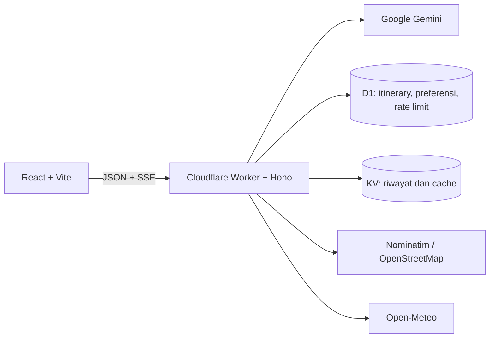

# Rute — AI Travel Planner

Perencana perjalanan berbahasa Indonesia yang mengubah percakapan menjadi itinerary multi-hari. Aplikasi mencari lokasi nyata melalui OpenStreetMap, memeriksa prakiraan cuaca yang tersedia, menyimpan preferensi pengguna, dan memungkinkan penyesuaian per hari melalui chat.

## Kemampuan

- Jawaban Gemini dikirim bertahap melalui Server-Sent Events (SSE).
- Itinerary terstruktur tersimpan di Cloudflare D1; riwayat chat 30 hari tersimpan di KV.
- Pencarian tempat nyata melalui Nominatim/OpenStreetMap dengan cache 24 jam.
- Prakiraan hingga 15 hari melalui Open-Meteo dengan cache 1 jam.
- AI dapat membuat itinerary baru atau mengganti satu hari tertentu.
- Preferensi jangka panjang dapat dilihat dan dihapus pengguna.
- Ekspor kalender `.ics` menggunakan waktu aktivitas dan durasi 90 menit; itinerary dapat dicetak atau disimpan sebagai PDF melalui browser.
- Session token anonim, pembatasan origin, validasi input, dan rate limit dasar melindungi data dan kuota model.
- Tampilan responsif untuk desktop dan perangkat bergerak.

Aplikasi tidak menyediakan harga penerbangan, hotel, tiket, jam buka, atau ketersediaan real-time. Informasi tersebut harus diverifikasi sebelum perjalanan.

## Arsitektur


```mermaid
graph LR
  Browser[React + Vite] -->|JSON + SSE| Worker[Cloudflare Worker + Hono]
  Worker --> Gemini[Google Gemini]
  Worker --> D1[(D1: itinerary, preferensi, rate limit)]
  Worker --> KV[(KV: riwayat dan cache)]
  Worker --> OSM[Nominatim / OpenStreetMap]
  Worker --> Weather[Open-Meteo]
```

Alur chat:

1. Browser meminta session ID dan token acak dari `POST /api/session`.
2. Worker menyimpan hash token; token mentah hanya disimpan di browser.
3. Pesan, riwayat, preferensi, dan itinerary aktif dikirim ke Gemini.
4. Gemini dapat mencari tempat/cuaca, menyimpan preferensi, membuat itinerary, atau mengganti satu hari. Maksimum empat putaran tool per pesan.
5. D1 menyimpan perubahan secara atomik melalui `DB.batch()` dan frontend mengambil ulang itinerary.

## Struktur penting

```text
backend/
  migrations/                          migrasi database lama
  src/ai.ts                            prompt dan deklarasi tool
  src/chat.ts                          Gemini, fallback, SSE, orkestrasi tool
  src/agent-tools.ts                   eksekusi dan penyimpanan tool
  src/travel-data.ts                   OpenStreetMap dan Open-Meteo
  src/session.ts                       session, history, preference, rate limit
  src/validation.ts                    validasi request dan argumen model
  schema.sql                           reset skema untuk development baru
frontend/
  src/App.tsx                          chat, itinerary, preferensi, status UI
  src/lib/sse.ts                       parser SSE tahan pemisahan network chunk
  src/lib/calendar.ts                  generator iCalendar
  src/components/Markdown.tsx          renderer Markdown tanpa raw HTML
```

## Prasyarat

- Node.js 24+
- Akun Cloudflare dan Google Gemini API key
- Dua terminal untuk menjalankan backend dan frontend

## Menjalankan lokal

### 1. Backend

```powershell
Set-Location backend
npm install
Copy-Item .dev.vars.example .dev.vars
# Isi GEMINI_API_KEY di .dev.vars
npx wrangler d1 execute travel-db --local --file=schema.sql
npm run dev
```

> **Peringatan:** `schema.sql` adalah reset development. Empat tabel aplikasi akan dihapus beserta datanya sebelum dibuat ulang. Jangan jalankan terhadap database yang datanya ingin dipertahankan.

Worker berjalan di `http://localhost:8787`.

Untuk database lama yang memakai skema awal, jangan jalankan `schema.sql`. Terapkan migrasi sekali. Migrasi memberi itinerary lama timezone `UTC`; buat ulang itinerary lama sebelum ekspor kalender jika zona tujuan berbeda.

```powershell
npx wrangler d1 execute travel-db --local --file=migrations/0001_secure_sessions_and_grounded_places.sql
```

Gunakan `--remote` sebagai pengganti `--local` untuk database deployment lama.

### 2. Frontend

```powershell
Set-Location frontend
npm install
Copy-Item .env.example .env.local
npm run dev
```

Frontend berjalan di `http://localhost:5173`. Nilai default `VITE_API_BASE` sudah menunjuk ke backend lokal.

### Verifikasi

```powershell
# backend
npm run check
npm test
npx wrangler deploy --dry-run

# frontend
npm run lint
npm test
npm run build
```

## Konfigurasi

### Backend

| Nilai | Lokasi | Keterangan |
|---|---|---|
| `GEMINI_API_KEY` | `backend/.dev.vars` / Wrangler secret | Wajib untuk chat. |
| `FRONTEND_ORIGIN` | `backend/wrangler.toml` | Origin yang diizinkan CORS. Beberapa origin dipisahkan koma. |
| D1 `database_id` | `backend/wrangler.toml` | Ganti placeholder sebelum deploy. |
| KV `id` | `backend/wrangler.toml` | Ganti placeholder sebelum deploy. |

Jangan commit `.dev.vars`. Untuk produksi:

```powershell
npx wrangler secret put GEMINI_API_KEY
```

### Frontend

| Nilai | Lokasi | Keterangan |
|---|---|---|
| `VITE_API_BASE` | `frontend/.env.local` / platform build env | URL Worker dengan suffix `/api`, tanpa trailing slash. |

Contoh produksi: `VITE_API_BASE=https://travel-planner.example.workers.dev/api`.

## Skema data

- `sessions`: ID session, hash access token, waktu dibuat.
- `rate_limits`: counter fixed-window atomik untuk pembatasan session dan chat.
- `user_preferences`: satu nilai per kategori/session melalui constraint `UNIQUE(session_id, preference_category)`.
- `itineraries`: tujuan, rentang tanggal, dan zona waktu IANA.
- `itinerary_items`: hari, waktu, aktivitas, kategori, alamat, koordinat, dan URL sumber OpenStreetMap.

Pembuatan itinerary dan penggantian satu hari menggunakan batch D1 agar tidak meninggalkan data parsial.

## API

Semua endpoint selain `POST /api/session` memerlukan header `X-Session-Token`.

| Method | Endpoint | Fungsi |
|---|---|---|
| `GET` | `/` | Health response JSON. |
| `POST` | `/api/session` | Membuat session; menerima `session_id` opsional untuk klaim satu kali session lama. |
| `POST` | `/api/chat` | Mengirim `{ session_id, message }`; respons SSE. |
| `GET` | `/api/history/:session_id` | Mengambil maksimum 20 pesan terakhir. |
| `GET` | `/api/itinerary/:session_id` | Mengambil itinerary terbaru. |
| `GET` | `/api/preferences/:session_id` | Mengambil preferensi tersimpan. |
| `DELETE` | `/api/preferences/:session_id/:category` | Menghapus satu preferensi. |

Event `/api/chat`:

```text
data: {"type":"text","text":"..."}

data: {"type":"system","message":"..."}

data: {"type":"function_call","name":"build_itinerary","status":"success"}

data: {"type":"error","message":"..."}

data: [DONE]
```

Payload event selalu dibuat dengan `JSON.stringify`; parser frontend mempertahankan event yang terpotong di antara network chunk dan berhenti setelah `[DONE]`.

## Model dan fallback

Urutan model saat ini:

1. `gemini-3.6-flash`
2. `gemini-flash-latest`
3. `gemini-2.5-flash-lite`

Error sementara `429`/`503` dicoba ulang sekali lalu berpindah model. Model `404` dilewati. Error autentikasi, izin, safety, atau request invalid langsung dikembalikan dan tidak disamarkan sebagai fallback.

## Deploy

1. Buat D1 dan KV produksi, lalu ganti kedua placeholder ID di `backend/wrangler.toml`.
2. Ubah `FRONTEND_ORIGIN` menjadi origin frontend produksi.
3. Terapkan `schema.sql` hanya pada database produksi baru.
4. Simpan `GEMINI_API_KEY` sebagai secret dan deploy Worker.
5. Set `VITE_API_BASE` di platform frontend, lalu build `frontend/dist`.

```powershell
Set-Location backend
npx wrangler d1 create travel-db
npx wrangler kv namespace create CHAT_HISTORY
npx wrangler d1 execute travel-db --remote --file=schema.sql
npx wrangler secret put GEMINI_API_KEY
npm run deploy

Set-Location ..\frontend
npm run build
```

## Batas keamanan dan layanan eksternal

- Session saat ini bersifat anonim, bukan akun pengguna. Token melindungi session yang diketahui, tetapi aplikasi publik berkuota tinggi sebaiknya menambahkan login atau Cloudflare Turnstile.
- Rate limit menggunakan counter fixed-window atomik di D1 (12 pesan/session/menit dan 30 pesan/IP/menit). Ini perlindungan dasar; deployment berkuota tinggi tetap sebaiknya memakai gateway/Turnstile dan kontrol abuse khusus.
- Public Nominatim memiliki batas absolut 1 request/detik dan ditujukan untuk penggunaan ringan. Hasil dicache 24 jam. Untuk produksi bervolume, gunakan instance Nominatim sendiri atau provider geocoding komersial sesuai [usage policy OSMF](https://operations.osmfoundation.org/policies/nominatim/).
- Open-Meteo tanpa API key ditujukan untuk penggunaan non-komersial; periksa paket/lisensi yang sesuai sebelum penggunaan komersial. Lihat [dokumentasi Open-Meteo](https://open-meteo.com/en/docs/).

## Troubleshooting

| Gejala | Tindakan |
|---|---|
| `no such column: access_token_hash` | Terapkan migrasi untuk database lama atau reset database development dengan `schema.sql`. |
| Request ditolak CORS | Samakan `FRONTEND_ORIGIN` dengan origin browser, termasuk port. |
| Frontend tetap memanggil localhost | Set `VITE_API_BASE` sebelum `npm run build`. |
| Status 401 setelah upgrade | Browser otomatis membuat session baru jika token lama tidak dapat diklaim. |
| Status 429 | Tunggu waktu pada header `Retry-After`; jangan menambah fallback model. |
| Data tempat/cuaca gagal | Tool akan memberi hasil error ke Gemini; periksa koneksi dan batas provider. |
